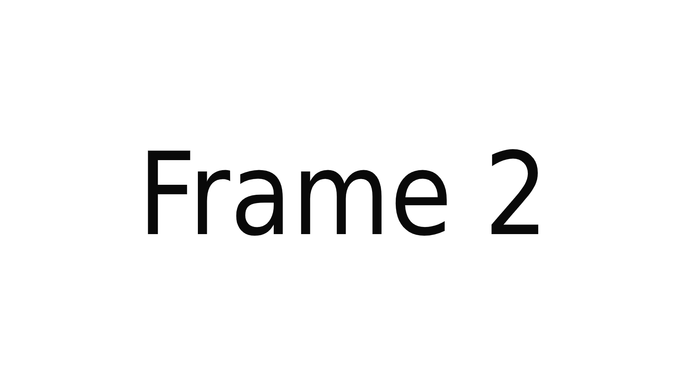
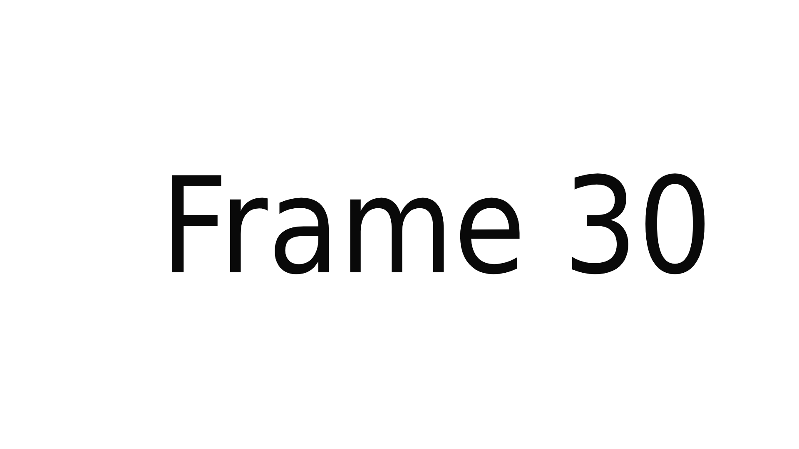

Automation testing on video players is one of the limitation of tools like selenium because, it requires some amount visual validations to make sure if the video is played properly.

In this repo, i have implemented an approach which can be used to automatically test the video players and check if the video is playing as expected.

For the demo, i have created a sample [video](https://www.youtube.com/watch?v=ayjsGkcwWC4) which we will be using it for testing the video player. In th sample video, each frame will display an number which corresponds to the current video time in seconds.

For example, if current video play time is `00:02`, then the frame in the video will have the text as `Frame 2` and if current video play time is `00:30` then the frame in the video will have the text as `Frame 30`. Below is a sample screenshot of how the frame actually looks.

###at 00:02

###at 00:30

Now, with the help of ocr(Optical character recognition) technique, we will take the screenshot of the video in particular time and extract the text for the currently displayed frame from the video player. So based on the current video time, we can check whether the current frame is actually displayed as expected.
For example, if the current video time is `00:30` then the text extracted from the current frame should have value as `Frame 30`. if the value is not `Frame 30` then we can assume, that there is some issue in playing the video.

By using this approach, we can almost test all features of the video player like seek forward, seek backward, pause, increase playback speed etc. But testing the audio is something which we have to use some different approach.  

I hope this should be good start for testing any video player using selenium.